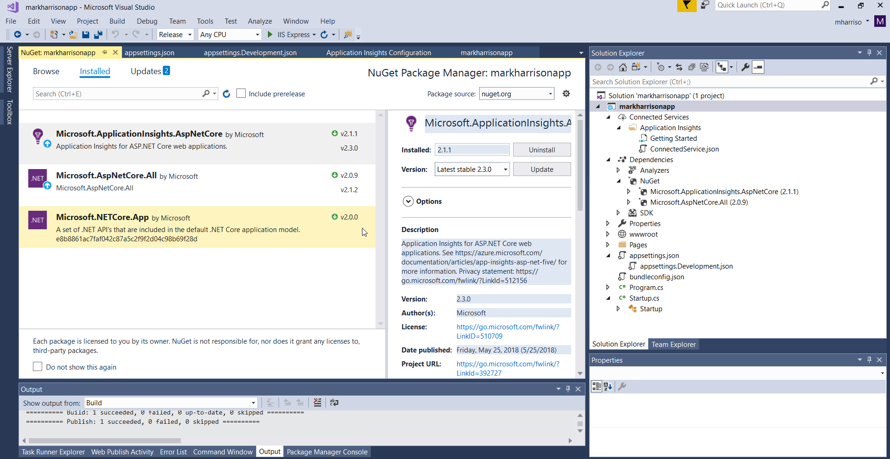

# Application Insights - Hands-on Lab Script - part 2

Mark Harrison : 6 Aug 2018


- [Part 1 - Create AppInsights instance](appinsights-1.md)  
- [Part 2 - Develop and deploy AppInsights enabled webapp](appinsights-2.md) ... this document
- [Part 3 - Get insights on application](appinsights-3.md)
- [Part 4 - Advanced Analytics](appinsights-4.md)  
- [Part 5 - Availability Monitoring](appinsights-5.md) ... this document
- [Part 6 - Usage Behaviour Analysis](appinsights-6.md)
  
## Develop and Deploy AppInsights enabled webapp

### Create a .NET Core Web Application

- Use Visual Studio 2017 to create the application


### Enable AppInsights

- Right click on project and select `Add` | `Application Insights Telemetry`


- There maybe a warning to update SDK - if so then accept
- Click `Get Started`  


- Select the AppInsights instance we created earlier


This process will insert some code into the WebApp to connect the app to the AppInsights instance and send the telemetry that is generated.

Also notice that the AppInsights IntrumentationKey has been added to the appsettings.json configuration file.

In real world development, different instrumentation keys should be used for dev / staging / production etc. to keep the telemetry separate across the different stages.  This can be done by setting the key in code from an environment variable.

```json
{
  "ApplicationInsights": {
    "InstrumentationKey": "2a676bbb-b8b4-43df-8ee3-16c1c5d8d635"
  }
}
```


Make sure the ApplicationInsights Nuget package is greater than 2.2.0 - upgrade if neccessary



### Client Monitoring

A JavaScript snippet must be added to the web page - this is used to analyze usage patterns and to detect and diagnose client side performance issues and failures.

- Select the `Getting Started` menu option


- Get the Snippet and add it to the _Layout.cshtml page in the WebApp.  This will insert the Javascript into every HTML page response, that uses this layout.


Note:  With .NET Core this Snippet appears to be automatically inserted, and so the above step is not required.

### Bad code

Add a new web page with some logic to the app to cause an exception - we will use this later.

The required code is documented at `Getting Started` menu option.


Below is example - the code will send the telemetry on an exception to App Insights.  


```c#
@page
@using Microsoft.ApplicationInsights
@{
    Layout = null;
    string strError = "error";
    try
    {
        int x = 100;
        x = x / 0;
    }
    catch (Exception ex)
    {
        // Report the exception to Application Insights.
        TelemetryClient _telemetryClient = new TelemetryClient();
        _telemetryClient.TrackException(ex);

        strError = ex.ToString();
    }
}

<!DOCTYPE html>
<html>
<head>
    <meta name="viewport" content="width=device-width" />
    <title>crash</title>
</head>
<body>
    <h1>Crash</h1>
    @Html.Raw(strError)
</body>
</html>
```

### Call backend service

Add a new web page with some logic to call some backend API or database - we will use this later

Below is example of how this could be done.


```c#
@page
@using System.Text;
@using System.Net;
@using System.IO;
@{
    ViewData["Title"] = "RSS";
    Layout = "~/Pages/_Layout.cshtml";

    string RSSFeedURL = "https://feeds.feedburner.com/azure1news";
    int bufSize = 65536;
    int length;
    byte[] buf = new byte[bufSize];
    StringBuilder sb = new StringBuilder(bufSize);

    HttpWebRequest request = (HttpWebRequest)WebRequest.Create(RSSFeedURL);
    HttpWebResponse response = (HttpWebResponse)request.GetResponse();
    Stream responseStream = response.GetResponseStream();

    // Read response stream until end
    while ((length = responseStream.Read(buf, 0, buf.Length)) != 0){
        sb.Append(Encoding.UTF8.GetString(buf, 0, length));
        }
}

<h1>RSS</h1>

@Html.Raw(sb.ToString())
```

### Snapshot Debugging

Optional step needed for Snapshot Debugging

Add SnapshotCollector Nuget package


Add the following code to startup.cs

```c#
using Microsoft.ApplicationInsights.SnapshotCollector;
using Microsoft.Extensions.Options;
using Microsoft.ApplicationInsights.AspNetCore;
using Microsoft.ApplicationInsights.Extensibility;
```

Add the following code to `class Startup` in startup.cs

```c#
    public class Startup
    {

        private class SnapshotCollectorTelemetryProcessorFactory : ITelemetryProcessorFactory
        {
            private readonly IServiceProvider _serviceProvider;

            public SnapshotCollectorTelemetryProcessorFactory(IServiceProvider serviceProvider) =>
                _serviceProvider = serviceProvider;

            public ITelemetryProcessor Create(ITelemetryProcessor next)
            {
                var snapshotConfigurationOptions = _serviceProvider.GetService<IOptions<SnapshotCollectorConfiguration>>();
                return new SnapshotCollectorTelemetryProcessor(next, configuration: snapshotConfigurationOptions.Value);
            }
        }

```

Add the following code to `IConfiguration Configuration` in startup.cs

```c#
        public IConfiguration Configuration { get; }

        public void ConfigureServices(IServiceCollection services)
        {
            // Configure SnapshotCollector from application settings
            services.Configure<SnapshotCollectorConfiguration>(Configuration.GetSection(nameof(SnapshotCollectorConfiguration)));

            // Add SnapshotCollector telemetry processor.
            services.AddSingleton<ITelemetryProcessorFactory>(sp => new SnapshotCollectorTelemetryProcessorFactory(sp));

            services.AddMvc();
        }

```

### Custom Events

We can instrument application code by augmenting the captured telemetry with custom events and custom metrics (continuous measurement).

This could also be used for behaviour monitoring, and identify what users do you your site.

The required code is documented at `Getting Started` menu option.


Below is example of how this could be done.

The Web page will generate a random color and send the result to the AppInsights telemetry.


```c#
@page
@using Microsoft.ApplicationInsights
@{
    ViewData["Title"] = "Color";
    Layout = "~/Pages/_Layout.cshtml";

    string[] strColors = { "red", "blue", "yellow", "green" };
    Random r = new Random();
    int rInt = r.Next(strColors.Length);
    string strRandColor = strColors[rInt];

    var tc = new TelemetryClient();
    var properties = new Dictionary<string, string> { { "Color", strRandColor} };
    tc.TrackEvent("ColorEvent", properties, null);
}

<h2>Color</h2>

<svg height="200" width="200">
    <circle cx="100" cy="100" r="95" stroke="black" stroke-width="3" fill="@Html.Raw(strRandColor)" />
</svg>
```


### Deploy Application

- Publish application to Azure
  - Select the WebApp resource created earlier


- Once published, we can access our web application


### Test web site  

Put the website under a load.  The following PowerShell may be useful, amend to the WebApp Url

```PowerShell
for ($i = 0 ; $i -lt 100; $i++)
{
 Invoke-WebRequest -uri http://markharrisonapp.azurewebsites.net/
}
```

### AppInsights Overview

Check the AppInsights overview page.

Note the response times, server requests, failed requests.


---
[Home](appinsights-0.md) | [Prev](appinsights-1.md) | [Next](appinsights-3.md)
